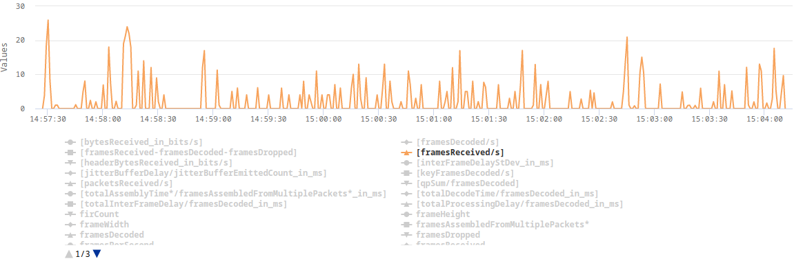
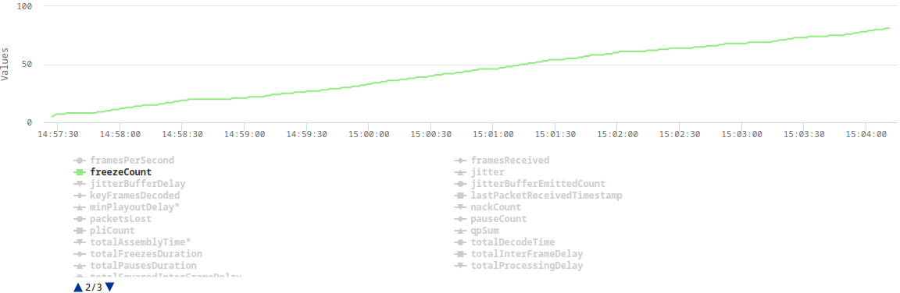
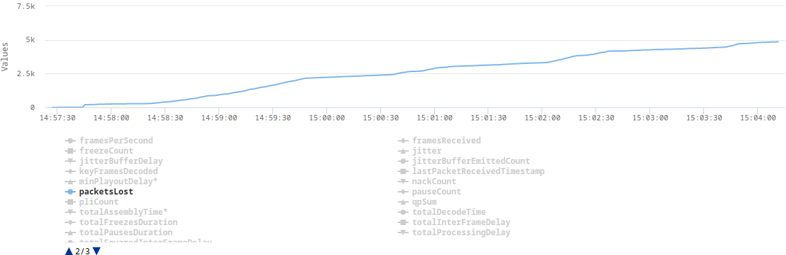

# Too small socket buffer a.k.a. packet loss in a local network

## The problem

At some point in implementing simulcast, we started noticing very strange statistics in the webrtc-internals.
On some of our machines, web browsers connected via our WebRTC SFU were dropping a lot of RTP packets and video frames.
The QoE was terrible.
The client was displaying something around 3 FPS.
It didn't matter whether we were testing in a local or remote network.
At the beginning, we thought that this is some kind of packet loss but we couldn't get how it might be possible
in the local network.
We entirely turned off simulcast, decreased resolution, changed codecs and downgraded web browsers.
Nothing helped.
The only thing we noticed was that the problem was not occurring on pretty strong machines like those with the 12th gen i9 processors or when we disabled TWCC.

Below, there are some plots from webrtc-internals dump that show the issue:





## The explanation

After implementing TWCC, a client can finally estimate its real bandwidth (without TWCC enabled, a browser assumes 300kbps) 
which in turn allows it to send video in a higher resolution or with a lower compression level.
The higher bitrate results in some video frames (e.g. keyframes) being split across multiple RTP packets.
This turned out to be challenging for our UDP socket which in Erlang is by default configured with a very small receive buffer.
When the client sent a burst of RTP packets which represent one video frame, some of those packets were immediately dropped as
they couldn't fit into the socket's receive buffer.

## The solution

The solution was as simple as increasing the socket's receive buffer.
In addition, we also increased the number of datagrams that can be read at once.

```
gen_udp:open(Port, [binary, 
            {ip, IP}, 
            {active, false},
            {recbuf, 1024 * 1024},
            {read_packets, 100}, 
            {reuseaddr, true}])
        end
```        