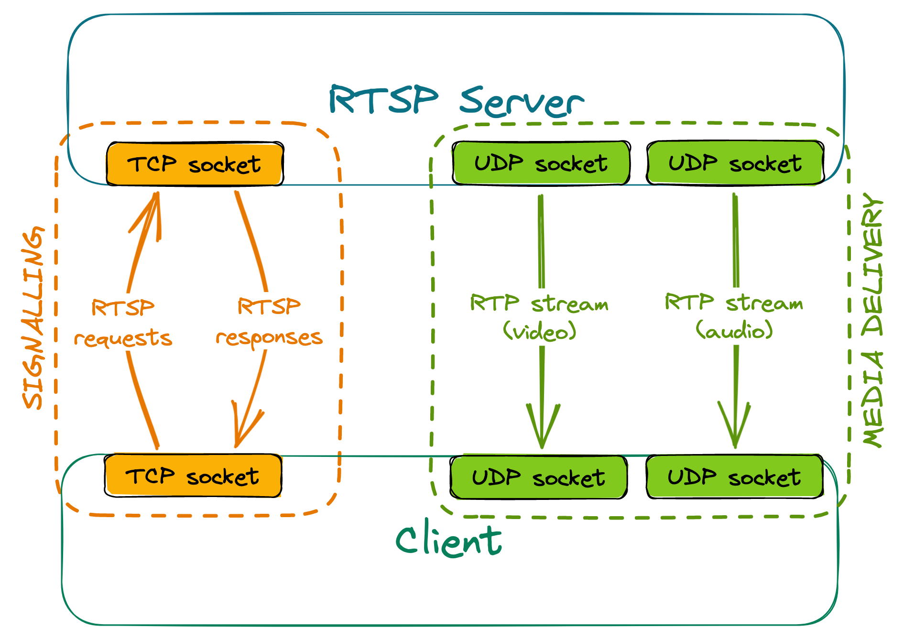

# Setting up the connection
To receive a stream from an RTSP server, at least two separate connections need to be made:
- one for session negotiation and signalling, using RTSP (usually over TCP)
- others for stream delivery (one per each stream), using RTP (usually over UDP)

An example setup could look like this:

## Signalling
The client sends various RTSP requests to the server, the most important ones being DESCRIBE, SETUP and PLAY.
The server responds to these requests accordingly, depending on the current state of the session.
- For a DESCRIBE request, the response will include information about codecs used by the server,
how many media streams it can offer, etc.
- SETUP requests must be targeted at a given stream. They communicate to the server that we wish to receive the stream,
and the response contains information such as ports between which the stream will flow.
- PLAY requests must be targeted at a given stream which has already been set up. After receiving a valid PLAY request,
the server will start sending media.

RTSP servers have a given timeout for sessions - if no requests are made within that timeout, the session is terminated.
For that reason, clients need to be sending keep-alive messages to the server regularly, or else they'll stop receiving
the stream once the timer is up. Most commonly, empty GET\_PARAMETER requests are used as keep-alives; alternatively,
some servers may extend the session automatically upon receiving an RTCP Receiver Report related to a given stream.

## Stream delivery
The client sends a separate RTSP SETUP request for each stream they want to receive.
These requests must contain the port, or port range, where the client expects to receive the stream.

Some RTSP servers may offer to set up two consecutive ports per stream - the first one for stream delivery,
the second one for the exchange of RTCP messages.

## Creating a NAT binding
Since RTP stream delivery is initiated by the server, if the client is behind NAT, a binding won't be created by itself,
and the stream won't reach the client. However, a simple hack can be used to combat this issue: During the negotiation,
we receive the port(s) from which the server will send the RTP stream. If we then send any datagram, even with an empty payload,
from the client port(s) configured during negotiation, to the server port(s) received, it will be enough to create a NAT binding,
which will allow the stream to reach the client, even when using the most restrictive, symmetric NAT.
