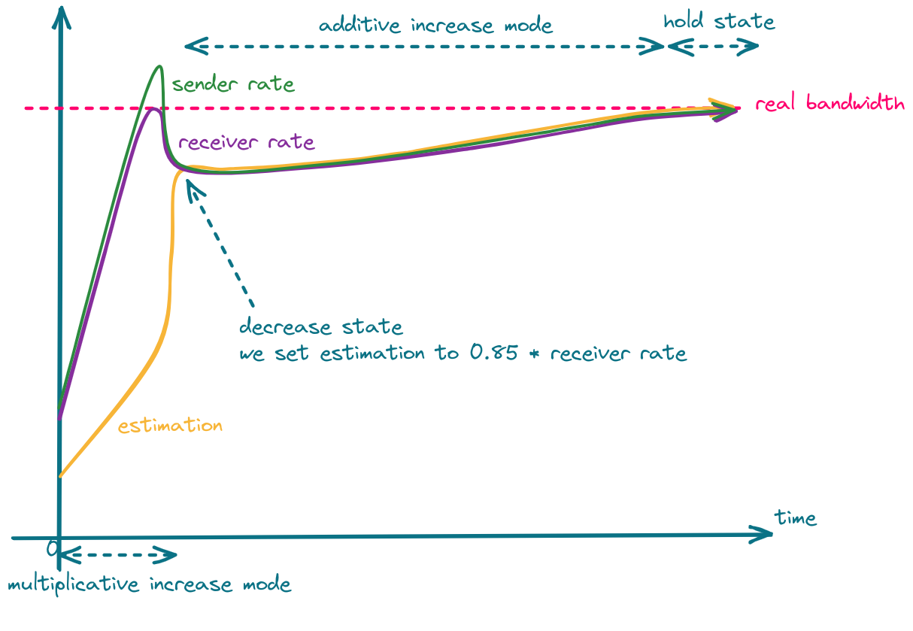
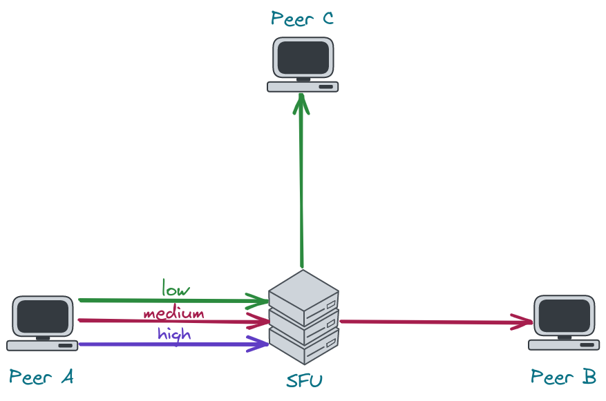

# WebRTC Congestion Control

## Congestion Control

The network has its capacity. When a sender sends more data than network devices are able to process,
packets will be delayed and finally dropped. Such a situation is called network congestion.

The goal of congestion control is to prevent network congestion by controlling the sender rate.
Every time a sender notices that the packet transmission times are increasing or packets are getting
lost, it should lower its rate.

## TWCC vs GCC

[TWCC (Transport-wide Congestion Control)][twcc-draft] defines a new RTP header extension and RTCP message 
that is used to give feedback on the arrival times of RTP packets to the sender.
Each RTP packet is assigned a transport-wide (unique across all RTP streams sent at the same socket) 
sequence number by the sender before transmission.
The receiver records the packets’ arrival timestamps and sends them back in TWCC Feedback messages.
Then the sender is able to determine network delay and packet loss, and react to them.
What this reaction looks like, i.e. how much the sender should lower its rate, when it should increase, when 
it should hold its rate, etc. is out-of-scope of TWCC and depends on a specific congestion control algorithm.
In other words, TWCC only provides the means necessary to implement an actual congestion control algorithm.

[GCC (Google Congestion Control)][gcc-draft] is an actual congestion control algorithm developed by Google.
It uses TWCC Feedback messages to determine when and by how much to increase and decrease the sender rate, 
as well as when the sender rate should remain at the current level.

## GCC

GCC's goal is to estimate the rate at which the sender can send its data.
The whole system depends on over-using the channel i.e. to get a higher estimation we have to increase our rate.
From the [RFC draft (sec. 5.5)][gcc-sec-5.5]:

> Since the system depends on over-using the channel to verify the current available bandwidth estimate, we must make
> sure that our estimate does not diverge from the rate at which the sender is actually sending.  
> Thus, if the sender is unable to produce a bit stream with the bitrate the congestion controller is asking for, 
> the available bandwidth estimate should stay within a given bound.

The bandwidth estimation provided by the congestion controller is in fact a request to the sender for producing 
the stream with a specific bitrate.
If the network behavior remains unchanged after increasing the sender rate, the estimation is increased.
If the network starts to get congested (transmission delay increases, packets get lost), the estimation
is decreased.
This way we slowly increase the sender rate up until the point at which the network can't accept any more data.

There are two increase modes: multiplicative and additive.
In the multiplicative mode, the estimation is increased by no more than 8% per second.
In the additive mode, the estimation is increased with at most half a packet per `response_time_interval` (RTT + 100ms).
In other words, the additive mode is much slower and is used when the estimation is close to convergence.
You can read more about selecting the proper increase mode in [section 5.5 of the GCC RFC draft][gcc-sec-5.5].

When we detect network overuse, the estimation is decreased to 85%-95% (the exact value depends on the implementation) of the latest receiver rate.

The whole process is shown in the following figure.

One can take advantage of the fact that in the decrease state, estimation is set to 85% of the latest receiver rate, and 
set the sender rate more aggressively, which should result in faster convergence.

## GCC & Simulcast

Let's consider a scenario where the network link between the server and the receiver is quite poor.
In such a case, the sender will send high-quality video to the server, but the receiver won't be able to receive it.
Limiting media quality on the server side is challenging, as sending video with a rate lower than the video
bitrate will result in frequent video rebuffering (video freezes).
What the server can do is request the sender to e.g. increase its compression level, decrease resolution or FPS,
or reencode the video on its own.
The former is problematic in sessions with more than 2 participants, as there might be only one host that
cannot handle high-quality video but the server will send all of the participants lower resolution.
The latter requires a lot of resources and is hard to achieve in real-time.
This leads us to use simulcast, which allows the sender to send multiple qualities in multiple FPS and the server to decide
which quality should be sent to which participant.
There are still some bitrate levels, so the server cannot lower its rate to any level, but in most cases
there is always a quality that will fit into the receiver network condition.

As stated before, bandwidth estimation depends on the amount of data that is sent.
Therefore, if the server sends little data, the estimation will be low.
An implication of this fact is that once the SFU selects a very low resolution it will never be able to switch to the higher one. 
To recover from this situation, the server has to increase the amount of data it sends, which leads us to connection probing.

## Connection Probing

When the server wants to recover from sending a low resolution to some peer, it has to generate additional traffic
to see if the network can handle more data.
This is what we refer to as "connection probing".

Unfortunately, connection probing is not standardized, so every SFU might do it in a different way.

The questions we need to answer are:
1. What data should we for probing?
1. How much should we probe?
1. How often should we probe?

### 1. What data should we use for probing?

The naive implementation would be to switch to the higher layer every `x` seconds and observe the network.
This, however, may lead to periodic video rebuffering and lower Quality of Experience (QoE).

Another solution is to generate traffic by sending RTP padding packets.
They contain only a header and some arbitrary data that should be ingored by the receiver.
In this case, the server has full control over the amount of data being sent and therefore, it can probe with 
different aggressiveness.

> **Deeper dive into RTP padding packet**
>
> The presence of padding in the RTP packet is denoted by the `P` bit in the RTP header.
> When it is set, the last byte in the RTP payload indicates the number of bytes that should be stripped out,
> including itself.
> RFC doesn't impose any requirements as to the value of padding bytes.
> In most cases, they are just zeros.
> The last byte denotes the size of the padding and, therefore, indicates the maximum size of the padding - 255.
> You can read more about padding in the [RFC 3550 (sec. 5.1)][rtp-sec-5.1].

The problem with padding packets is that they contain only padding so we end up sending
a lot of garbage data, which is useless for the client.
Fortunately, there is a solution which is called RTX.
RTX is a shortcut for retransmissions and can be used instead of padding packets.
How does it work?
Instead of sending padding packets, we simply retransmit media packets via a dedicated RTP stream.
This way, we have full control over the probing rate, and we send data that is useful for the client.
That's also the way libwebrtc chooses when the RTX extension is enabled.

#### Probing with padding packets

In our WebRTC implementation, we started with padding packets, as they are easier to implement and give
pretty good results.

Here are some tips that are important when using padding packets:
* padding packets can only be sent at the video frame boundary.
Otherwise, the decoder in a web browser might get out-of-sync, and you will see a lot of freezes.
How do you know when a video frame ends?
Just check the `M` bit in the RTP header.
For most codecs, the `M` bit set to `1` means the end of a video frame.
* you have to take care of rewriting sequence numbers
* as a timestamp for the padding packet, you can use the timestamp of the last RTP packet with the `M` bit set
* sending padding packets will cause your SRTP window to move forward. 
This might be problematic for out-of-order packets making it impossible to encrypt them, as their sequence number
will not fit into the encryption window.
To solve this, you can either carefully increase the encryption window (an encryption window that is too large might
introduce security vulnerabilities) or just drop the packet.

### 2. How much should we probe?

The estimation can increase by at most 8% per second.
This means that there is no point in probing much more than your estimation can increase.
E.g. if you send 2Mbps, the estimation will increase by 160kbps per second.
Keeping in mind that the limit for 1280x720 resolution in chromium is ~2.5Mbps and
Google Meet limits this bitrate even more to 1.5Mbps, picking 200kbps as a value for your prober should be enough.

### 3. How often should we probe?

The two most basic scenarios are:
* try to probe every `x` seconds e.g. every 30 seconds.
If the network finally improves, the server will switch to a higher resolution.
This, however, means that the server might do unnecessary work pretty often, even if there is no progress.
* use exponential backoff algorithm. 
Probe e.g. 10 seconds after lowering the resolution.
If the network is still unstable, try again in 20 seconds.
If the situation doesn't change, wait 40 seconds and so on.

[twcc-draft]: https://datatracker.ietf.org/doc/html/draft-holmer-rmcat-transport-wide-cc-extensions-01
[gcc-draft]: https://datatracker.ietf.org/doc/html/draft-ietf-rmcat-gcc-02
[gcc-sec-5.5]: https://datatracker.ietf.org/doc/html/draft-ietf-rmcat-gcc-02#section-5.5
[rtp-sec-5.1]: https://www.rfc-editor.org/rfc/rfc3550#section-5.1