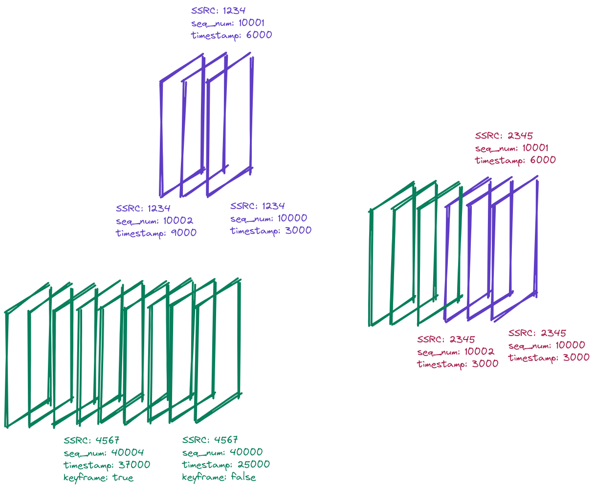

# Simulcast

<!-- 
1. What is simulcast
2. the need for simulcast
3. Unaware receiver 
4. Munging, munging everywhere
5. Final overview
6. How to munge?
7. When to switch between encodigns? 

don't forget to mention
* track encoding activity
* bandwidth limits
* track encoding bitrate
* differences between codecs (h264 has no temporal scalability)
* disabling simulcast
* temporal scalability vs spatial scalability
* turning on on the client side
* known problems
-->

Simulcast is a technique where a client sends multiple encodings of the same video to the server
and the server is chooses and forwards proper encoding to a proper receiver (other client).
The encoding selection is dynamic (SFU switches between encodings in time) and is based on:
* receiver awailable bandwidth
* receiver preferences (e.g. explicit request for specific video quality)
* UI layaout (e.g. videos displayed in smaller video tiles will be sent in lower resolution)

## The need for simulcast

The first section suggest a couple of reasons why simulcast is so useful.

First of all, a receiver with low bandwidth can have a negative impact on other receivers.
Frequently lost packets will result in higher number of requests for keyframes to the sender.
As a result, the sender will increase track bitrate that will have to be handled by all receivers.
Thanks to simulcast we can send lower quality version of the track to the receiver with low bandiwdth
and better quality to the remaining participants.

Simulcast can also be used to adjust video quality to the user preferances.
Although, not every encoding can be active at the given moment (see ...) we can provide best effort system where
user can select target encoding -- encoding it wants to receive whenever possible.

Another useful feature is to lower video quality as the number of participants increases.
When a session has 20 participants, each of which is displayed in a pretty small video tile, we can save some bandwidth
by sending lower video quality.

## Unaware receiver

Simulcast is a feature implemented between a sender and the server.
The server, switches between encodings transparently from the receiver point of view.
The only thing that receiver can notice is changing resolution and FPS.
Neither SDP offer/answer nor RTP packets contain simulcast specific attributes
on the server-receiver path.
This also implies that:
* server has to rewrite some fields of RTP packets to avoid gaps in sequence numbers or timestamps after encoding switch i.e. receiver has to think it is still receiving the same RTP stream
* encoding switch has to be performed when server receives a keyframe from the new encoding. 
In other case video will freeze for a while after switching encodings. 
 
## Munging, munging everywhere

WebRTC has always been related to munging.
What does it mean?
Munging is a process of taking something returned by some API and modyfing it on our own.
What can be munged?
A very common practice is to munge SDP offer/answer to enable/disable some WebRTC feature ond the client side.
Some WebRTC features, although already implemetned in a web browser, they don't have standardized API.
In such cases, to enable or disable on of such features, you have to generate SDP offer/answer and modify it on your own
often using some regexps.

Another example of munging is modyfing RTP packets on the server side.
Because the server receives mutiple encodings of the same video, it has to rewrite parts of RTP packet header
and RTP payload to e.g provide sequence numbers continuity.

<!--  

## Mungers

Mungers are responsible for modyfing RTP packets so that switching between encodings is transparent
for the receiver.
Currently, there are two mungers: RTP Munger and VP8 Munger. 
H264 doesn't require modyfing its RTP packets so there is no H264 Munger.

### RTP Munger

Rewrites RTP Header fields - sequence numbers and timestamps.
SSRC is being rewritten by other Membrane element.

### VP8 Munger

Rewrites VP8 RTP payload fields - keyidx, picture_id, tl0picidx

## Disabling Simulcast

Simulcast can be disabled per WebRTC Endpoint.
At the moment, if client offers simulcast but we don't accept it, we will
disable the whole track.
This is not compliant with WebRTC standard as we should only remove SDP attributes 
related to simulcast and be prepared for receiving one encoding.
However, in such a case browser changes SSRC after ICE restart and 
we cannot handle this at the moment. -->
